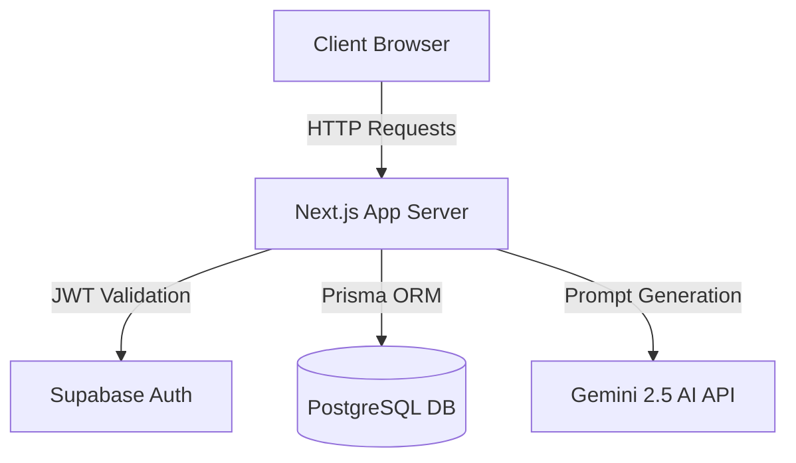
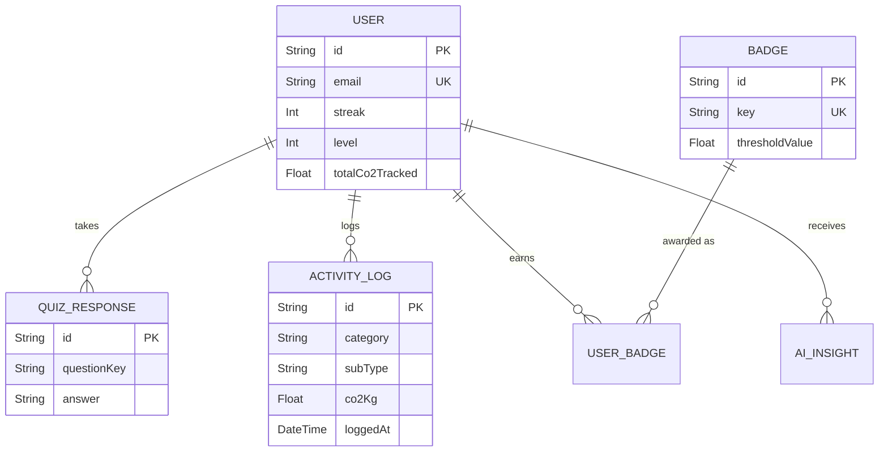

# EcoTrack: System Design & Architecture

Welcome to the EcoTrack repository! This document serves as a comprehensive guide for new developers to understand the project's high-level architecture, system design, and core workflows.

## 1. Project Overview
**EcoTrack** is a full-stack web application designed to help individuals track and reduce their carbon footprint. By combining daily activity logging with personalized AI insights and gamification (badges, levels, streaks), the platform motivates users to build sustainable habits.

## 2. Tech Stack
The project is built on a modern, highly scalable JavaScript ecosystem:
- **Framework:** Next.js 15 (App Router)
- **Frontend:** React 19, Tailwind CSS v4, shadcn/ui, Recharts, Framer Motion
- **Backend:** Next.js Serverless Route Handlers (`/app/api/*`)
- **Database:** PostgreSQL (Hosted on Supabase)
- **ORM:** Prisma Client
- **Authentication:** Supabase Auth (Email/Password)
- **AI Integration:** Google Gemini 2.5 Flash API
- **Testing:** Jest (Unit/API) and Playwright (E2E)

## 3. High-Level System Architecture



### 3.1 Client-Server Communication
- **Client Components (`'use client'`):** Used sparingly for interactivity (forms, charts, UI state). They make HTTP POST/GET requests to Next.js API routes.
- **Server Components:** Used by default for layouts, data-fetching, and SEO.
- **API Routes (`/app/api/*`):** Act as the backend controller layer. They validate incoming data, verify authentication tokens via `@supabase/ssr`, interact with the database via Prisma, and return JSON.

## 4. Database Schema (Entity Relationship)

Our PostgreSQL database is managed via Prisma (`prisma/schema.prisma`).



### Key Architectural Decisions regarding Data:
- **Dual Auth Systems:** When a user signs up, a record is created in Supabase Auth's internal `auth.users` table. We immediately create a synchronized record in our public `users` table via Prisma to store gamification data (streaks, levels).
- **Hardcoded Emission Factors:** To keep database queries fast, emission factors (e.g., CO2 per km driven) are hardcoded in `src/lib/emission-factors.ts` rather than stored in the database.

## 5. Directory Structure

```text
hack2skillVirtual/
├── e2e/                        # Playwright E2E browser tests
├── __tests__/                  # Jest unit and API integration tests
├── prisma/
│   ├── schema.prisma           # Database schema & migrations
│   └── seed.ts                 # Script to seed default Gamification Badges
├── src/
│   ├── app/
│   │   ├── (auth)/             # Signup & Signin pages
│   │   ├── (dashboard)/        # Main app UI (Dashboard, Quiz, Logs)
│   │   ├── api/                # Next.js API Route Handlers
│   │   ├── layout.tsx          # Global HTML wrapper & Fonts
│   │   └── page.tsx            # Landing Page
│   ├── components/             # Reusable React components (UI, Charts, Forms)
│   ├── lib/                    # Core utilities and singletons
│   │   ├── co2-calculator.ts   # Core business logic for carbon math
│   │   ├── emission-factors.ts # Static CO2 constant values
│   │   ├── prisma.ts           # Prisma singleton client
│   │   └── supabase/           # SSR and Browser auth clients
│   ├── middleware.ts           # Route protection (redirects unauthenticated users)
│   └── types/                  # Shared TypeScript interfaces
└── tailwind.config.ts          # Organic Biophilic theme definitions
```

## 6. Core Workflows

### Authentication Flow
1. User visits `/signup`.
2. Form submits to `POST /api/auth/signup`.
3. Route creates user in Supabase via `supabase.auth.signUp()`.
4. Route inserts mirrored record into `Prisma.User`. (If this fails, a rollback deletes the Supabase auth record).
5. User is redirected to `/quiz`.
6. Subsequent requests are protected by `src/middleware.ts` which checks the Supabase Session Cookie.

### Activity Logging & Gamification Flow
1. User submits a daily activity via the `/log` page.
2. `POST /api/activities` intercepts the request.
3. The server cross-references `src/lib/emission-factors.ts` to calculate the exact `co2Kg` saved/emitted.
4. The activity is saved to `ActivityLog`.
5. The user's `totalCo2Tracked` and `streak` are updated in the `User` table.
6. The gamification engine checks if new `totalCo2Tracked` crosses any `Badge` thresholds and awards them.

### AI Insights Flow
1. A cron job or dashboard page load triggers a request to `GET /api/insights`.
2. The server queries the user's recent `ActivityLogs`.
3. The server constructs a prompt containing the user's activity trends and sends it to the Google Gemini API.
4. Gemini returns actionable, personalized JSON tips (e.g., "Take the train on Tuesday to save 15kg CO2").
5. The insight is cached in the `AiInsight` table and displayed on the frontend.
