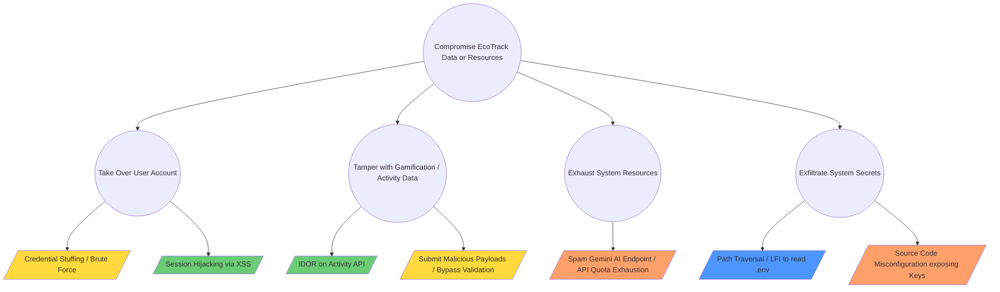

# EcoTrack Threat Model & Scope

## 1. Scope Definition

### In-Scope Targets
*   **Next.js Frontend (React 19)**: Client-side routing, form validations, UI state, and session handling.
*   **Next.js Route Handlers (Backend API)**: API endpoints handling activity logging, insights generation, and user data retrieval.
*   **Database Interactions (Prisma)**: ORM queries and data serialization.
*   **Authentication Flow**: Integration with Supabase Auth (JWT handling, session persistence).
*   **AI Integration**: Communication logic between the backend and Gemini 2.5 Flash API.

### Out-of-Scope Constraints
*   **Infrastructure Security**: Underlying security of Supabase's hosted PostgreSQL and Auth services.
*   **Third-Party AI Services**: Security of Google's Gemini infrastructure.
*   **Physical Security**: Physical access to user devices or developer workstations.
*   **Social Engineering**: Phishing attacks against developers or users (except as a modeled threat scenario).
*   **Denial of Service at Network Level**: Volumetric DDoS attacks against Vercel/Next.js hosting infrastructure.

### Assumptions
*   Supabase Auth is configured securely with appropriate password policies and JWT signing keys.
*   The connection to the database (`DATABASE_URL` / `DIRECT_URL`) and Gemini (`GEMINI_API_KEY`) is secured via environment variables and never exposed to the client.
*   Communication between all components happens over HTTPS/TLS.

---

## 2. Architecture & Trust Boundaries

### Critical Assets
1.  **User Credentials & Sessions**: Supabase Auth tokens.
2.  **User PII & Activity Data**: Dietary choices, commute habits, energy usage, and calculated carbon footprint.
3.  **Application Secrets**: `GEMINI_API_KEY`, `DATABASE_URL`.
4.  **Gamification State**: User levels, badges, and streaks (integrity of the gamification system).
5.  **AI Quota/Billing**: API usage limits for Gemini.

### Trust Boundaries
*   **Boundary 1 (Internet - Untrusted vs. Next.js Server - Trusted)**: The primary attack surface. All input from the user browser must be validated and sanitized before processing.
*   **Boundary 2 (Next.js Server - Trusted vs. Supabase/PostgreSQL - Trusted)**: The server accesses the database using server-side credentials. We trust the DB to enforce Row Level Security (if configured) or rely on the backend APIs to enforce authorization.
*   **Boundary 3 (Next.js Server - Trusted vs. Gemini API - External)**: The server sends user context to Gemini. We trust Gemini to process it securely, but must not send unnecessary PII.

---

## 3. Threat Scenarios (STRIDE Analysis)

| Category | Threat | Impact | Mitigation Strategy |
| :--- | :--- | :--- | :--- |
| **Spoofing** | Session Hijacking via XSS or insecure cookies | High (Account Takeover) | Use `HttpOnly`, `Secure` cookies. Implement proper Content Security Policy (CSP). |
| **Tampering** | Modifying API requests to log fake activities and boost gamification stats | Medium (Integrity Loss) | Strict input validation on Route Handlers using Zod. Enforce rate limiting on activity logging. |
| **Repudiation** | User denies performing certain actions or modifications | Low | Maintain audit logs of critical actions (e.g., account deletion, major profile changes). |
| **Information Disclosure** | Insecure Direct Object Reference (IDOR) allowing a user to read another's footprint data | High (Privacy Breach) | Implement strict authorization checks in Next.js APIs ensuring `userId` matches the authenticated session. |
| **Information Disclosure** | Accidental leakage of Gemini API key to the client | Critical (Financial / Compromise) | Ensure environment variables do not use `NEXT_PUBLIC_` prefix unless explicitly meant for the client. |
| **Denial of Service** | Exhaustion of Gemini API limits through automated, repeated insight requests | High (Financial/Availability) | Implement aggressive rate limiting on the `/api/insights` endpoint. Cache AI responses where possible. |
| **Elevation of Privilege** | Standard user accesses administrative endpoints (if any exist) | High | Role-Based Access Control (RBAC) checks on all privileged API routes. |

---

## 4. Attack Tree Analysis

**Root Goal: Compromise EcoTrack Data or Resources**

### Critical Attack Paths & Mitigations
1.  **Exhaust System Resources (API Quota Exhaustion)**
    *   **Attack**: An attacker sends thousands of requests to the AI insights generation endpoint.
    *   **Mitigations**: Implement IP-based and User-based rate limiting on the specific route handler. Cache recent insights to prevent redundant API calls.
2.  **Tamper with Gamification / Activity Data (IDOR & Input Validation)**
    *   **Attack**: Attacker intercepts API request and changes the `userId` or injects extreme values for `co2Saved`.
    *   **Mitigations**: The backend MUST extract `userId` strictly from the verified Supabase Auth JWT token, NOT from the request body. Validate all numerical inputs against reasonable bounds.
3.  **Take Over User Account (Session Hijacking)**
    *   **Attack**: Attacker uses XSS to steal authentication tokens or session data.
    *   **Mitigations**: Rely on Supabase's secure cookie implementation. Ensure React properly escapes all user-rendered content (e.g., in user profiles or activity notes) to prevent XSS.
